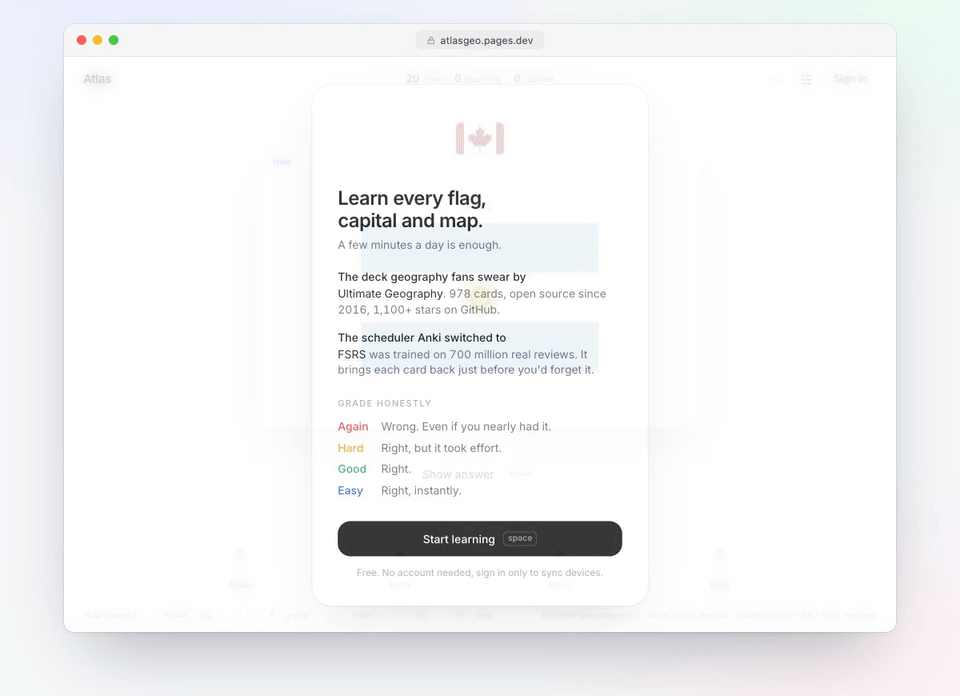

# Atlas

Every country, capital, flag and map, learned with spaced repetition. Free, no account needed.

**[atlasgeo.pages.dev](https://atlasgeo.pages.dev)**



## Why

I play [Krillion](https://krillion.io) and GeoGuessr and kept losing on the same things: micro-states in the Pacific and Caribbean, capitals nobody mentions, flags that look alike. The best material for this is the [Ultimate Geography](https://github.com/anki-geo/ultimate-geography) Anki deck, but the Anki apps are dated and fiddly. Atlas is that deck with a front end I actually want to open every day: it starts straight into today's cards, everything is a keystroke, and the scheduler is FSRS, the same algorithm Anki uses, tuned to the settings its authors recommend.

## How it works

978 cards cover every flag, capital and location in the deck. Space flips a card. `1` to `4` grades it Again, Hard, Good or Easy and the card flies into a pile. That's the whole loop. Each grade tells FSRS how well you know the card, and the next review is booked for just before you'd forget it.

Grade honestly. Again means you got it wrong, even if you nearly had it. Hard means right but slow, and FSRS counts it as a pass, so using it for a miss pushes the card too far out.

The top bar shows today's new, learning and review counts with a progress line underneath. A short welcome explains all this on first visit and reopens from "How it works" in the footer.

Every name has a pre-recorded neural pronunciation in a US or British voice, picked from your browser's language (press `S`). Any card can show its location map (`M`) or open in Google Maps (`G`). Filters let you drill a region or a card type. Sign in with Google to sync progress across devices, or don't. It works offline as an installable web app and updates itself when a new version ships.

## Keys

| Key | Action |
| --- | --- |
| `space` | Flip, or Good when flipped |
| `1` `2` `3` `4` | Again, Hard, Good, Easy |
| `z` | Undo |
| `s` | Pronounce |
| `m` | Show map |
| `g` | Open in Google Maps |

## Stack

Vite, React, TypeScript, Tailwind, Motion, [ts-fsrs](https://github.com/open-spaced-repetition/ts-fsrs), Dexie (IndexedDB). Hosted on Cloudflare Pages with a small Pages Function and D1 for sync. Pronunciation clips are generated once with Microsoft neural voices via [edge-tts](https://github.com/rany2/edge-tts) and shipped as static files.

## Scheduling

FSRS with desired retention 0.90, 20 new and 200 reviews a day, random new-card order that differs per browser, a warm-up of six well-known flag and map cards for brand-new learners, siblings buried for the day, one 10 minute learning and relearning step, day rollover at 4am, leeches tagged at 8 lapses but never suspended.

## Sync

Card states are last-write-wins. The review log is append-only and merged across devices, and undo deletes its entry everywhere. Today's counts are rebuilt from the log, so studying on a laptop and a phone adds up instead of one overwriting the other. Cards graded before signing in merge into the account on sign-in.

## Develop

```bash
pnpm install
pnpm dev
```

`pnpm dev` runs the front end only. To run it with the sync API, put `SESSION_SECRET` (and optionally `GOOGLE_CLIENT_ID`) in `.dev.vars`, then:

```bash
npx wrangler d1 migrations apply atlas --local
pnpm build && npx wrangler pages dev dist
```

`pnpm build:deck` rebuilds `src/data/deck.json` from the CrowdAnki export in `deck-src/`. `scripts/build-audio.py` regenerates the pronunciation clips.

Deploy:

```bash
npx wrangler d1 migrations apply atlas --remote
pnpm build && npx wrangler pages deploy dist --project-name atlasgeo --branch main
```

Production needs `SESSION_SECRET` and `GOOGLE_CLIENT_ID` set as Pages secrets.

## Credits

[Ultimate Geography](https://github.com/anki-geo/ultimate-geography) by anki-geo. Deck content is public domain (Unlicense); images are CC BY-SA / CC BY / CC0 / public domain, see [sources.csv](https://github.com/anki-geo/ultimate-geography/blob/master/src/media/sources.csv).
